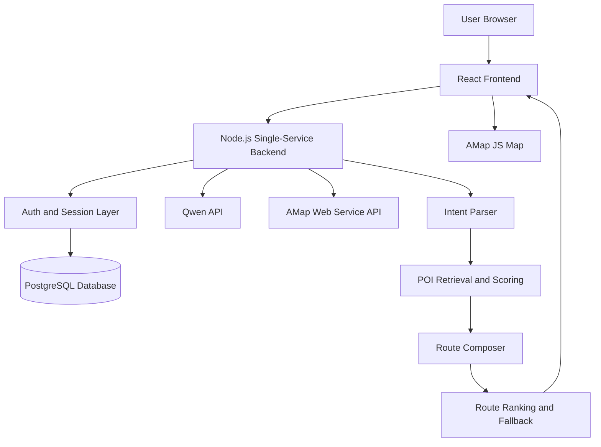

# Wander Technical Documentation Draft / 技术报告双语草稿

> Suggested file name / 建议文件名: `Session2Group16_TechnicalDoc.docx`  
> Product / 产品名称: Wander  
> Session and Group / 组别: Session 2 — Group 16  
> Student IDs / 学号: `[fill in your team member IDs]`  
> Final Word Count / 最终字数: `[fill after editing]`

---

## Section 1 — System Architecture

### English version

Wander is a single-service web application that helps users convert a short free-time window into an executable city route. The system receives a natural-language request, current or manually selected start location, time budget, travel mode, and user preferences. It then combines Qwen-based intent understanding with AMap real POI search and route calculation to generate three route options. Users can select a route, view stop details, adjust stops, and open navigation.

The product is implemented as a React frontend and a Node.js backend served from the same web service. The frontend handles login, onboarding, location permission, map interaction, time/travel-mode input, route selection, and profile settings. The backend handles authentication, session cookies, PostgreSQL user storage, Qwen API calls, AMap Web Service requests, route composition, POI scoring, and fallback logic.

### 中文理解版

Wander 是一个单服务部署的 Web 应用，目标是帮助用户把课后或下班后的碎片时间转化成可执行的城市路线。系统会接收用户的自然语言需求、GPS 或手动选择的出发点、时间预算、出行方式和用户偏好，然后结合千问进行意图理解，调用高德地图进行真实地点检索和路线计算，最终生成三条可选择路线。用户可以选择路线、查看站点详情、调整站点，并打开导航。

### Architecture diagram / 系统架构图

You can paste this diagram into a Mermaid editor and export it as an image for the Word document.



### Main components

| Component | Responsibility | Key files / technologies |
|---|---|---|
| React frontend | User interface, routing, login flow, map display, route selection, profile settings | `src/`, React, React Router, Vite |
| Wander state layer | Shared application state for location, route generation, user profile, saved addresses and selected route | `src/wander-state.tsx` |
| Planner UI | Collects user request, start point, time budget and travel mode | `src/components/PlannerPanel.tsx` |
| Routes UI | Displays route options, selected route timeline, map preview and stop details | `src/pages/RoutesPage.tsx`, `src/components/SelectedRoutePanel.tsx` |
| Node backend | Serves frontend files and `/api` endpoints in one service | `server/index.mjs` |
| Route planning engine | Intent parsing, POI retrieval, route composition, scoring and fallback | `server/planner.mjs`, `server/amap.mjs` |
| Authentication | Register, login, session cookies, password hashing and profile update | `server/user-store.mjs`, PostgreSQL |
| External APIs | Qwen for structured route blueprints; AMap for POIs, reverse geocoding and route estimates | DashScope/Qwen, AMap Web Service and JS Map |

### Data flow

1. The user logs in or registers an account.
2. The user grants GPS permission, manually selects a point on the map, or searches for a start address.
3. The user enters a free-text request, selects a time budget and chooses a travel mode.
4. The frontend sends a request to `POST /api/plans/generate`.
5. The backend reverse-geocodes the start location with AMap.
6. Qwen converts the user request into structured route blueprints and stop signals.
7. AMap searches real POIs for each stop category and keyword.
8. The planner scores candidates based on keyword relevance, distance, rating and route feasibility.
9. The route composer builds three candidate routes and calculates travel durations for walking, riding and taxi/driving.
10. The frontend shows route options and lets the user view, edit, remove, add or reorder stops.

### Main API endpoints

| Endpoint | Method | Purpose |
|---|---:|---|
| `/api/health` | GET | Health check for local and Render deployment |
| `/api/auth/register` | POST | Create account and store hashed password |
| `/api/auth/login` | POST | Validate credentials and create session |
| `/api/auth/session` | GET | Load current logged-in user |
| `/api/auth/profile` | PATCH | Update avatar, nickname, gender, occupation and saved profile fields |
| `/api/auth/logout` | POST | Clear session cookie |
| `/api/location/reverse` | POST | Reverse geocode latitude/longitude into nearby place/address |
| `/api/location/search` | POST | Search AMap address candidates for manual start-point selection |
| `/api/plans/generate` | POST | Generate route options from user request, location, time and travel mode |

---

## Section 2 — Technology Justification

### English version

Wander uses a React + Node.js architecture because the product needs fast UI iteration, map interaction, API orchestration and single-service deployment. React was selected for the frontend because the interface is highly stateful: users move between login, onboarding, homepage planning, route selection, stop details and profile settings. React Router supports page-level navigation while keeping the shared planning state in a central provider.

Node.js was selected for the backend because it integrates naturally with the React/Vite stack and supports asynchronous API calls to Qwen, AMap and PostgreSQL. A single-service deployment was chosen instead of separate frontend and backend services because it reduces deployment complexity for internal testing. Render can build the frontend, run the Node server, serve static assets, and expose API endpoints from the same URL.

PostgreSQL was selected for user data because it is reliable, structured and supported directly by Render. It stores user accounts and sessions, while passwords are protected using PBKDF2 hashes rather than plain text. Local development can fall back to a JSON file when `DATABASE_URL` is unavailable, but production uses PostgreSQL.

Qwen was selected for natural-language understanding because the product needs to interpret flexible Chinese and English outing requests. However, Qwen does not directly invent final routes. It produces structured route blueprints, categories, search terms and stop signals. Real POIs and travel times are then determined by AMap and deterministic route scoring. This reduces hallucination risk.

AMap was selected because the target users are in Chinese cities, and AMap provides stronger local POI coverage, address search, reverse geocoding and navigation links than international open-source map data in this context. Open-source map services were considered earlier, but they had too few local nodes and unreliable POI coverage for Taicang and nearby Chinese urban areas.

### 中文理解版

Wander 使用 React + Node.js 的架构，是因为这个产品需要快速迭代界面、处理地图交互、整合多个 API，并且需要方便部署到网站。React 适合处理复杂状态，例如登录、注册、主页规划、路线选择、地点详情和个人中心。React Router 负责页面切换，`WanderProvider` 负责共享路线和用户状态。

后端选择 Node.js，是因为它和 React/Vite 技术栈配合自然，也适合处理千问、高德和 PostgreSQL 的异步请求。我们选择单服务部署，而不是前后端分开部署，是为了降低内测部署复杂度。Render 可以在同一个服务里构建前端、启动 Node 后端、提供静态页面和 API。

数据库选择 PostgreSQL，是因为它适合用户账号、会话和资料这类结构化数据，并且 Render 原生支持。密码不明文存储，而是使用 PBKDF2 哈希。没有数据库时，本地可以 fallback 到 JSON 文件，但线上使用 PostgreSQL。

千问用于理解用户自然语言，但不直接“编造路线”。它输出结构化的路线蓝图、类别、关键词和站点需求；真实地点和路线时间由高德 API 与确定性评分逻辑决定。这可以降低大模型幻觉风险。

高德地图被选择是因为目标用户位于中国城市，高德在中国 POI、地址搜索、逆地理编码和导航链接方面更稳定。之前尝试过开源地图方案，但在太仓等本地场景中 POI 节点不足，无法可靠支持真实路线规划。

### Alternatives considered

| Decision area | Chosen option | Alternative considered | Reason for choice |
|---|---|---|---|
| Frontend | React + Vite | Static HTML/CSS or Vue | React supports complex state, routing and component reuse. Vite provides fast development and production builds. |
| Backend | Node.js single service | Serverless functions or separate backend | One service is easier to deploy and debug for internal testing. |
| Database | PostgreSQL | Local JSON only | PostgreSQL supports real account persistence and concurrent users. |
| Map provider | AMap | OpenStreetMap/OpenRouteService | AMap has stronger China POI coverage and better local address search. |
| LLM | Qwen | Pure rules or direct route generation by LLM | Qwen improves flexible intent parsing, but deterministic map-based scoring keeps results grounded. |
| Deployment | Render | Local-only or custom server | Render provides quick HTTPS deployment, environment variables and PostgreSQL integration. |

### Technical risks and mitigation

| Risk | Impact | Mitigation |
|---|---|---|
| GPS can be inaccurate in browsers | User may start from the wrong side of a road or nearby campus | Added manual map point selection and keyword-based start address search |
| LLM may misunderstand user intent | Route may miss required activities | Added keyword parsing, category mapping, required terms and POI validation before final route selection |
| External API timeout or quota | Route generation can fail or become slow | Added timeouts, fallback logic, progress state and clearer generation error handling |
| Map POI data may not match all niche requests | Some user intents may return weak candidates | Route planner expands search terms and radius, and future work includes POI caching and quality monitoring |
| Bilingual display can mix Chinese and English | Foreign users may see unclear location or route text | Added localization logic and pinyin/English display handling for Chinese place names |

---

## Section 3 — Deployment Guide

### English version

Wander can run locally or be deployed as a single Node web service. The project root used by the application is the `ent_app` folder. The frontend is built into `dist/`, and the backend serves both the static frontend and the API endpoints.

### Local setup

1. Open a terminal in the application folder:

```powershell
cd C:\Users\Roxy\Desktop\project\ent_app\ent_app
```

2. Install dependencies:

```powershell
npm install
```

3. Create `.env.server.local` for local secrets:

```env
WANDER_API_PORT=8788
DASHSCOPE_API_KEY=your_dashscope_key
DASHSCOPE_BASE_URL=https://dashscope.aliyuncs.com/compatible-mode/v1
QWEN_INTENT_MODEL=qwen-plus
AMAP_WEB_SERVICE_KEY=your_amap_web_service_key
VITE_AMAP_JS_KEY=your_amap_javascript_key
VITE_AMAP_SECURITY_JSCODE=your_amap_security_jscode
DATABASE_URL=your_postgresql_connection_string
POSTGRES_SSL=true
```

4. Start the development stack:

```powershell
npm run dev
```

This starts Vite and the API server for development.

5. For a local production-style test:

```powershell
npm run build
npm start
```

Then open:

```text
http://localhost:8788
```

Health check:

```text
http://localhost:8788/api/health
```

### Render deployment

1. Push the GitHub repository containing the `ent_app` folder.
2. In Render, create a new Blueprint or Node Web Service.
3. Set the root directory to `ent_app`, or use `ent_app/render.yaml`.
4. Use the following commands:

```text
Build command: npm run build
Start command: npm start
Health check path: /api/health
```

5. Add environment variables in the Render dashboard:

```env
DASHSCOPE_API_KEY=your_qwen_key
DASHSCOPE_BASE_URL=https://dashscope.aliyuncs.com/compatible-mode/v1
QWEN_INTENT_MODEL=qwen-plus
AMAP_WEB_SERVICE_KEY=your_amap_web_service_key
VITE_AMAP_JS_KEY=your_amap_js_key
VITE_AMAP_SECURITY_JSCODE=your_amap_security_jscode
DATABASE_URL=your_render_postgresql_internal_url
POSTGRES_SSL=true
WANDER_BASIC_AUTH_USER=optional_internal_test_user
WANDER_BASIC_AUTH_PASSWORD=optional_internal_test_password
```

6. Deploy the service and open the Render URL.
7. Confirm that `/api/health` returns an `ok` response.
8. Register a test account and generate a route using a realistic prompt, for example: “I want hotpot, a movie, and a park walk.”

### Database setup

In production, Wander uses PostgreSQL through `DATABASE_URL`. The backend creates the required tables automatically on first use:

| Table | Purpose |
|---|---|
| `wander_users` | Stores user email, hashed password, profile and saved user information |
| `wander_sessions` | Stores session tokens and expiry time |

Passwords are not stored in plain text. The backend stores PBKDF2 password hashes and sends the browser an HttpOnly session cookie after login.

### 中文理解版

Wander 可以本地运行，也可以作为一个 Node 单服务部署。真正的应用目录是 `ent_app` 子文件夹。前端构建后输出到 `dist/`，后端负责同时提供静态前端页面和 API。

本地运行时需要在 `ent_app` 目录中执行 `npm install`、配置 `.env.server.local`，然后使用 `npm run dev` 开发，或使用 `npm run build` 和 `npm start` 模拟生产环境。线上部署时，在 Render 中设置 Root Directory 为 `ent_app`，Build Command 为 `npm run build`，Start Command 为 `npm start`，并配置千问、高德和 PostgreSQL 的环境变量。PostgreSQL 数据表会在第一次使用时自动创建。

---

## Section 4 — IP Strategy

### English version

Wander is a web-based route planning product for students and young working adults who want to turn short free-time windows into executable city outings. The system combines natural-language input, GPS/manual start-point selection, time budget, travel mode, Qwen-based intent understanding, AMap POI search, and multi-stop route generation.

### Novelty analysis

The broad idea of AI itinerary generation is not fully novel, because existing commercial products and patents already cover AI-assisted travel planning, POI-based route optimization and language-model-assisted navigation. Wander’s novelty is more incremental and contextual. It focuses on short spontaneous outings in Chinese cities rather than long vacation planning. It also combines manual start-point correction, saved personal addresses, time-budget control, travel-mode-based duration calculation, AMap real POI retrieval and three route options inside one lightweight web flow.

### Prior art

| Existing product / patent | What it does | How Wander differs |
|---|---|---|
| WayGenAI — https://www.waygen.ai/ | A commercial AI route planner that creates optimized multi-stop routes from natural-language input. | Wander focuses on short local outings in Chinese cities and integrates AMap POIs, saved addresses and post-class/after-work time windows. |
| Triply — https://triplyplanner.com/ | An AI itinerary planner that converts saved places or travel ideas into planned routes. | Triply is more travel-itinerary oriented, while Wander is designed for immediate local departure and fragmented leisure time. |
| US20240418515A1 — Using a language model to localize and route plan for navigation systems — https://patents.google.com/patent/US20240418515A1/en | A patent application describing language-model support for localization and route planning. | Wander does not claim the broad use of LLMs for navigation. Its difference is the product workflow and integration of local POI scoring, time budget, travel mode and Chinese map data. |
| US9726510B2 — Route optimization including points of interest — https://patents.google.com/patent/US9726510B2/en | A patent involving route optimization with points of interest. | Wander uses POIs as required activity stops from a natural-language leisure request, not only as optional POIs around an existing route. |

### Patent decision

We would not apply for a patent at this stage. The core concept has significant prior art in AI route planning, itinerary generation and POI-based route optimization. A Chinese invention patent would be expensive and take too long for a student team, while a utility model is not suitable because Wander is mainly software rather than a hardware structure. The current novelty is useful for product differentiation, but it is probably not strong enough for a defensible patent claim.

### Alternative protection

The best short-term protection strategy is trade secret protection combined with selective open-source sharing. The most valuable assets are the server-side route scoring logic, prompt structure, category mapping, fallback rules, API configuration and user behavior insights. These should remain in a private repository and be protected through environment variables, access control, database permissions and not exposing API keys. At the same time, selected frontend components or demo materials can be open-sourced later to build credibility and attract testers without revealing the most sensitive routing logic.

| Strategy | Cost | Speed | Protection strength for Wander |
|---|---:|---:|---|
| Chinese utility model | Medium | 6–12 months | Weak, because Wander is mainly software and not a hardware/structural invention |
| Invention patent | High | 2–3 years | Uncertain, because prior art is strong and novelty may be narrow |
| Trade secret | Low | Immediate | Stronger for code, prompts, ranking rules, API configuration and operational know-how |
| Selective open source | Low | Immediate | Useful for trust, testing and collaboration, but sensitive backend logic should stay private |

### 中文理解版

Wander 的广义概念并不是完全新的，因为市场上和专利库中已经存在 AI 行程规划、POI 路线优化和语言模型辅助导航相关产品或专利。Wander 的创新点更偏“增量创新”和“场景创新”：它不是做长途旅游规划，而是聚焦中国城市中课后或下班后的短时间即时出行。系统把手动纠正定位、常用地址、时间预算、出行方式、高德真实 POI、三条路线选择和路线编辑整合在一个轻量 Web 流程里。

目前不建议申请专利。原因是已有 prior art 较多，发明专利成本高、周期长，而实用新型更适合硬件结构创新，不适合 Wander 这种软件产品。更合理的保护方式是把后端路线评分逻辑、提示词结构、类别映射、fallback 规则、API 配置和用户数据洞察作为商业秘密保护，同时未来可以选择性开源非敏感前端组件来增强可信度。

---

## Section 5 — Limitations & Future Work

### English version

Wander is functional as an internal-test website, but several limitations remain before it can become a reliable public product.

### Known limitations

| Limitation | Why it exists | Impact on users |
|---|---|---|
| Route generation can be slow or fail | Qwen and AMap are external APIs with latency, timeout and quota constraints | Users may wait too long or see generation errors during peak usage |
| Browser GPS can be inaccurate | Web geolocation depends on device, network and browser permission quality | The start point may be 50–100 meters away from the real location |
| POI quality depends on AMap data | The system relies on AMap search results, ratings and available POI metadata | Some niche requests may return weak or incomplete candidates |
| Bilingual place translation is imperfect | Chinese store names are difficult to translate accurately without a dedicated place-name translation service | English-speaking users may see pinyin or partially translated names |
| Route editing is still basic | Users can add, remove and reorder stops, but route re-optimization is limited | Manual edits may not always produce the globally best route order |
| No large-scale user analytics yet | The project is currently in internal testing | The team cannot yet measure retention, route-following rate or real-world satisfaction at scale |

### Future work

| Planned improvement | Description |
|---|---|
| Background job queue | Move long route-generation tasks into a queue so planning can continue reliably even if users switch pages |
| POI cache | Cache frequent search results such as hotpot, cinema, cafe and park by city/adcode to reduce API latency and cost |
| Route-quality monitoring | Track whether generated routes satisfy all user-required activities, stay within time budget and use real POIs |
| Better multilingual support | Use a dedicated place-name translation strategy or official English place metadata where available |
| Smarter route editing | Recalculate route order and travel times after users add, remove or drag stops |
| User feedback loop | Collect thumbs-up/down, followed-route confirmation and stop-card interactions to improve ranking |
| Safety and privacy review | Strengthen location privacy, data retention policy and account-security controls before public release |

### Technical debt

The current project evolved quickly from a course prototype into a deployable web application, so some technical debt remains. The route planning logic should be modularized further into separate services for intent parsing, POI retrieval, scoring, route composition and copy generation. Error messages should be standardized across frontend and backend. The current local fallback logic should be documented more clearly and eventually replaced with a stronger cache layer. Automated tests should be added for authentication, intent parsing, route scoring and API failure handling.

### Open research question

The main open research question is how to reliably measure whether a generated route truly satisfies a user’s intention. Keyword matching can verify obvious requirements such as “hotpot” or “cinema,” but subjective requirements such as “somewhere relaxing,” “not too crowded,” or “good for a date” require richer data. Future versions may combine user feedback, UGC tags, crowd-level data and historical route acceptance to improve this.

### 中文理解版

Wander 目前已经可以作为内部测试网站运行，但要成为真正可公开使用的产品，还需要解决稳定性、定位准确性、POI 数据质量、多语言和路线编辑等问题。主要限制包括外部 API 超时、浏览器 GPS 精度有限、高德 POI 数据覆盖不均、中文店名英文翻译难、路线编辑后重新优化不足，以及缺乏大规模用户数据。

下一步应重点建设后台任务队列、POI 缓存、路线质量监控、多语言地点名策略、路线编辑后的重新排序、用户反馈机制和隐私安全审查。技术债方面，路线规划逻辑需要进一步模块化，错误处理需要统一，并且应增加自动化测试。

---

## References

Alibaba Cloud. (n.d.). DashScope model service. https://help.aliyun.com/zh/dashscope/

AMap. (n.d.). AMap Web Service API documentation. https://lbs.amap.com/api/webservice/summary

AMap. (n.d.). AMap JavaScript API documentation. https://lbs.amap.com/api/javascript-api/summary

Google Patents. (n.d.). US20240418515A1 — Using a language model to localize and route plan for navigation systems. https://patents.google.com/patent/US20240418515A1/en

Google Patents. (n.d.). US9726510B2 — Route optimization including points of interest. https://patents.google.com/patent/US9726510B2/en

PostgreSQL Global Development Group. (n.d.). PostgreSQL documentation. https://www.postgresql.org/docs/

React. (n.d.). React documentation. https://react.dev/

Render. (n.d.). Web services documentation. https://render.com/docs/web-services

Triply. (n.d.). Triply planner. https://triplyplanner.com/

Vite. (n.d.). Vite documentation. https://vite.dev/

WayGenAI. (n.d.). WayGenAI route planner. https://www.waygen.ai/
